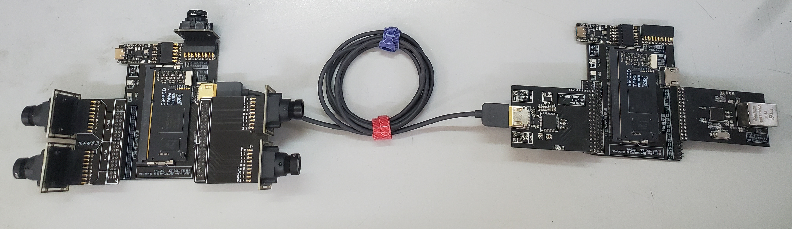

# 基于高云FPGA的多路网络视频监控编码系统

## 项目简介

本项目为2023年全国大学生嵌入式芯片与系统设计竞赛——FPGA创新设计竞赛（高云赛道）项目，题目基于高云FPGA的多路网络视频监控编码系统。整个项目分为三个部分，采集端、编码端与上位机。

## 文件夹描述

FPGA_Project：项目的采集端与编码端及其他调试程序

PC_sortware：项目使用到的上位机

python_test：使用python脚本测试简易版视频编解码算法的压缩效率（暂时未考虑

# 复现过程

1、准备材料（闲鱼搜大猪蹄子 FPGA可搜到个人店铺购买材料）：

​	采集端：猪蹄板+正点原子双目+黑金双目

​	编码端：猪蹄板+adv7611 HDMI解码模块+RTL8211 GMII以太网模块

​	上位机：支持千兆网的PC一台

​	显示器：支持HDMI 720P60即可

2、采集端使用工程 FPGA_Project\\**ov5640_9134_stitching**，

3、编码端使用工程FPGA_Project\\**udp_gmii_adv7611_720p60**

4、上位机使用工程 PC_sortware\\**demo_1122**

4、电脑端IP设置：地址：192.168.2.102  网关：192.168.2.1 DNS：255.255.255.0

5、连接设备，采集端USB接电脑，HDMI接7611；编码端USB接电源，7611接采集端，HDMI接显示器，网口接电脑，打开上位机

**功能复现：**

1、采集端：通过串口给FPGA发送16进制的00 or 01 以切换不同的主副摄

2、编码端：通过在L8\M6处和相邻的GND通过短接帽控制01，可控制上位机数据 30/60FPS、RGB565\GREY8四挡可调，传输码率随之在228、456和912Mbps三档切换（此功能不影响环出显示

3、上位机端：点击截图键直接截图保存，点击录制键开始录制，再次点击时停止，并保存视频文件到本地

## 版本更新

20231111：初始版本

20231203：整理复现开源文档

20231211：整理部分问题解答和复现材料购买

## 常见问题

1、 上位机闪退：用wireshark看看收发的IP端口是否与上说讲解一致

2、环出画面黑屏/闪屏：当前版本兼容性有一定问题，部分显示器可稳定显示，部分可能几分钟闪一次
